# Omarchy Aesthetic Themes & Live Video Wallpapers (`omarchy-aesthetic-themes`)

> **Unofficial / Community Suite**: A standalone, all-in-one repository bundling 15 handcrafted anime-aesthetic color themes, full-resolution static wallpaper PNGs, 15 synchronized live MP4 video wallpapers, and an automated mpvpaper live wallpaper engine for Omarchy Hyprland.

This project was developed through an AI-assisted workflow. The concept, customization, configuration, testing, integration, and final iteration were directed and carried out by me.

---

## My Contribution

I did not write Omarchy, Quickshell, Hyprland, or mpvpaper from scratch. What I contributed:

- **Theme Design**: Curated and crafted 15 complete `colors.toml` palettes, each hand-tuned for Omarchy Quickshell, Foot, Ghostty, Kitty, and Alacritty terminals, and application window borders — covering anime series including Solo Leveling, Jujutsu Kaisen, Chainsaw Man, Black Clover, Hell's Paradise, and Bleach.
- **Wallpaper Sourcing & Organization**: Identified, organized, and placed 15 matching static PNG wallpapers inside each theme's `backgrounds/` folder.
- **Live Video Wallpaper Collection**: Sourced, curated, and organized 15 60FPS/4K MP4 video loops matched to each theme in `wallpapers/videos/`.
- **Live Wallpaper Daemon**: Configured and scripted the `omarchy-live-wallpaper` daemon using mpvpaper with zero-delay Unix domain socket hot-swapping (`/tmp/mpvpaper-ipc.sock`) and auto-pause battery saving.
- **Interactive HUD**: Designed and configured `omarchy-menu-live-wallpapers` for previewing and selecting themes and videos via a floating menu with a single hotkey.
- **Installer**: Authored the `./install.sh` automation script for placing all themes, wallpapers, videos, and scripts into correct Omarchy paths.
- **Documentation**: Wrote all guides, the theme catalog table, placement instructions, and troubleshooting docs.
- **Integration & Testing**: Tested all themes end-to-end on Omarchy 4.0.2 / Hyprland 0.56.2 / Quickshell 0.3.1 on an AMD Ryzen 7 PRO 5850U system.

---

## Based On / Credits

- **[Omarchy](https://github.com/basecamp/omarchy)** — The open-source Arch Linux desktop environment and theme system by Basecamp. All themes are designed to be compatible with the Omarchy theme format (`colors.toml`, `shell.toml`).
- **[Quickshell](https://quickshell.outfoxxed.me)** — The Qt6 QML Wayland layer-shell desktop shell that powers the Omarchy bar and widget system.
- **[Hyprland](https://hyprland.org)** — The Wayland tiling compositor on which this entire desktop is built.
- **[mpvpaper](https://github.com/GhostNaN/mpvpaper)** — The Wayland wallpaper daemon using mpv for video playback.
- **[mpv](https://mpv.io)** — The open-source media player powering mpvpaper.
- Wallpaper and video credits: Individual wallpapers are sourced from community sites (moewalls.com, mylivewallpapers.com, wallpaperwaifu.com). No copyrighted content is bundled — users must supply their own video files.

**Related Repos**:
- [omarchy-theme-transitions](https://github.com/aarushdalal/omarchy-theme-transitions) — GPU-accelerated theme transition shaders
- [omarchy-wallpaper-guide](https://github.com/aarushdalal/omarchy-wallpaper-guide) — Guide for static and live wallpaper setup
- [omarchy-shell-polish](https://github.com/aarushdalal/omarchy-shell-polish) — Frosted glass, floating bar, keybinding polish

---

## What is in this Repository?

Everything needed for a sensory, unified desktop transformation:

1. **15 Curated Themes**: Complete `colors.toml` color palettes tailored for Omarchy Quickshell, terminal emulators (Foot, Ghostty, Kitty, Alacritty), and application borders.
2. **15 Static Wallpapers**: Crisp PNG wallpapers placed in each theme's `backgrounds/` folder.
3. **15 Live Video Wallpapers**: 60 FPS animated MP4 video loops located in `wallpapers/videos/` (**not bundled** — see sourcing notes below).
4. **Live Wallpaper Engine**: `omarchy-live-wallpaper` daemon with zero-delay Unix domain socket hot-swapping and auto-pause battery saving.
5. **Interactive Floating HUD**: `omarchy-menu-live-wallpapers` for previewing and selecting themes and videos.
6. **Automated Installer**: Single `./install.sh install` command that configures all paths, services, and scripts.

---

## Theme Catalog & Video Index

| Theme | Accent | Background | Live Video (MP4) | Static Image (PNG) |
|---|---|---|---|---|
| **Solo Leveling: Shadow Monarch** | `#4361ee` | `#060714` | `sung-jin-woo-beru-solo-leveling-moewalls-com.mp4` | `sololeveling_monarch.png` |
| **Solo Leveling: Shadow Army Arise** | `#9d4edd` | `#080514` | `mylivewallpapers-com-Shadow-Army-Solo-Leveling-4K.mp4` | `sololeveling_shadow_army.png` |
| **Solo Leveling: God Statue Smile** | `#00d2ff` | `#030710` | `mylivewallpapers-com-Solo-Leveling-Smile-4K.mp4` | `sololeveling_smile.png` |
| **Jujutsu Kaisen: Sukuna Fūga** | `#ff4800` | `#0c0201` | `ryomen-sukuna-fuga-jujutsu-kaisen-wallpaperwaifu-com.mp4` | `sukuna_fuga.png` |
| **Jujutsu Kaisen: Malevolent Shrine** | `#e60026` | `#080102` | `ryomen-sukuna-jujutsu-kaisen-moewalls-com.mp4` | `sukuna_malevolent_shrine.png` |
| **Jujutsu Kaisen: Gojo Infinity** | `#ffffff` | `#000000` | `mylivewallpapers-com-Minimal-Circle-Gojo-4K.mp4` | `gojo_infinity.png` |
| **Jujutsu Kaisen: Yuta & Rika Dark Ocean** | `#00d2ff` | `#030814` | `yuta-x-rika-dark-ocean-jujutsu-kaisen-moewalls-com.mp4` | `yuta_rika_dark_ocean.png` |
| **Jujutsu Kaisen: Kenjaku Prison Realm** | `#06b6d4` | `#02070d` | `mylivewallpapers-com-Prison-Realm-Kenjaku-FHD.mp4` | `kenjaku_prison_realm.png` |
| **Chainsaw Man: Reze Bomb Devil** | `#c026d3` | `#050209` | `reze-bomb-devil-chainsaw-man-1-moewalls-com.mp4` | `reze_bomb_devil.png` |
| **Chainsaw Man: Denji Chainsaw Rage** | `#ff5500` | `#080405` | `mylivewallpapers-com-Chainsaw-Man-Rage-3440X1440.mp4` | `chainsaw_rage.png` |
| **Black Clover: Black Asta Demon Form** | `#d90429` | `#000000` | `black-asta-moewalls-com.mp4` | `black_asta.png` |
| **Hell's Paradise: Gabimaru Hollow Flame** | `#f5f5f5` | `#000000` | `gabimaru-hollow-flame.1920x1080.mp4` | `gabimaru_hollow_flame.png` |
| **Bleach: Ichigo Hollow Mask** | `#f97316` | `#07080c` | `ichigo-hollow-mask.1920x1080.mp4` | `ichigo_hollow.png` |
| **The Matrix: 4K Digital Rain** | `#ff2a6d` | `#020004` | `matrix-digital-moewalls-com.mp4` | `matrix_digital.png` |
| **BMW M4: Night Drive Neon Glow** | `#3a86ff` | `#03090e` | `BMW-M4.mp4` | `BMW_M4_night.png` |

---

## Repository Structure

```
omarchy-aesthetic-themes/
├── themes/                  # 15 theme directories, each with colors.toml and backgrounds/
│   ├── solo-leveling-monarch/
│   ├── sukuna-fuga/
│   └── ... (15 total)
├── wallpapers/
│   └── videos/              # MP4 video loops (not bundled — source separately)
├── bin/                     # omarchy-live-wallpaper, omarchy-menu-live-wallpapers scripts
├── systemd/                 # Systemd user service for the wallpaper daemon
├── assets/showcase/         # Screenshot gallery
├── docs/                    # Detailed guides
│   ├── PLACEMENT-GUIDE.md
│   ├── RUN-GUIDE.md
│   ├── THEMES-REFERENCE.md
│   └── TROUBLESHOOTING.md
└── install.sh               # Automated installer
```

---

## Requirements

- **Arch Linux** with **Omarchy 4.0.2**
- **Wayland / Hyprland 0.56.2**
- **Quickshell 0.3.1**
- **`mpv`** and **`mpvpaper`**:
  ```bash
  sudo pacman -S mpv
  which mpvpaper || yay -S mpvpaper
  ```

---

## Installation

```bash
git clone https://github.com/aarushdalal/omarchy-aesthetic-themes.git
cd omarchy-aesthetic-themes

# Check requirements
./install.sh check

# Preview without changing files
./install.sh install --dry-run

# Place all themes, wallpapers, and scripts
./install.sh install
```

---

## Usage

- **Apply Theme Palette**:
  ```bash
  omarchy theme set solo-leveling-monarch
  ```
- **Launch Live Video Wallpaper**:
  ```bash
  omarchy-live-wallpaper start solo-leveling-monarch
  ```
- **Open Floating HUD Selector**:
  ```bash
  omarchy-menu-live-wallpapers
  ```
- **Stop Live Wallpaper**:
  ```bash
  omarchy-live-wallpaper stop
  ```

---

## Complete Guides

- 📂 [**File Placement Guide**](docs/PLACEMENT-GUIDE.md): Complete list of file locations, targets, and manual copy commands.
- 🚀 [**Live Running Guide**](docs/RUN-GUIDE.md): Operational architecture, IPC socket hot-swapping, and auto-sync hooks.
- 🎨 [**Themes Reference**](docs/THEMES-REFERENCE.md): In-depth color specifications, palettes, and media index.
- 🛠️ [**Troubleshooting & Recovery**](docs/TROUBLESHOOTING.md): Emergency stop commands and GPU hardware decoding.

---

## Showcase

### Gallery

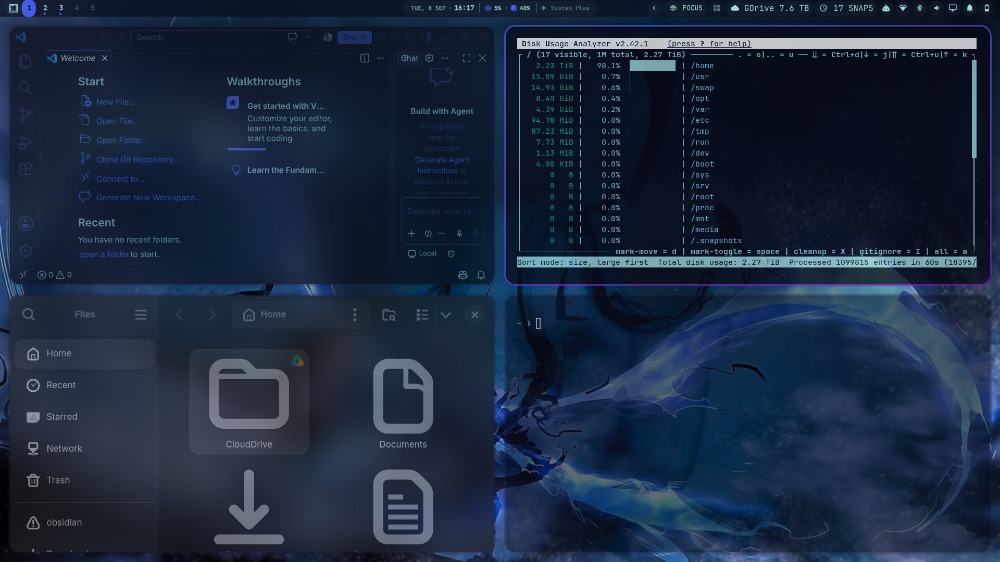
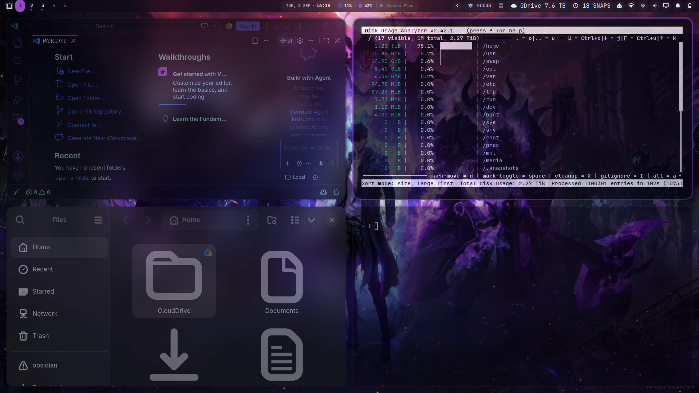
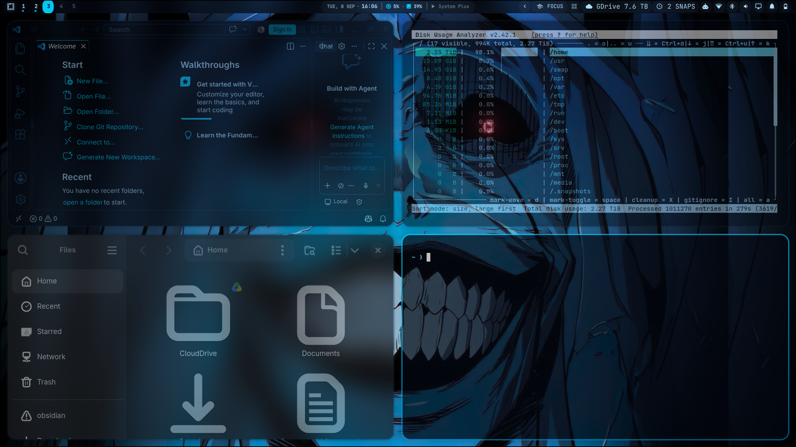
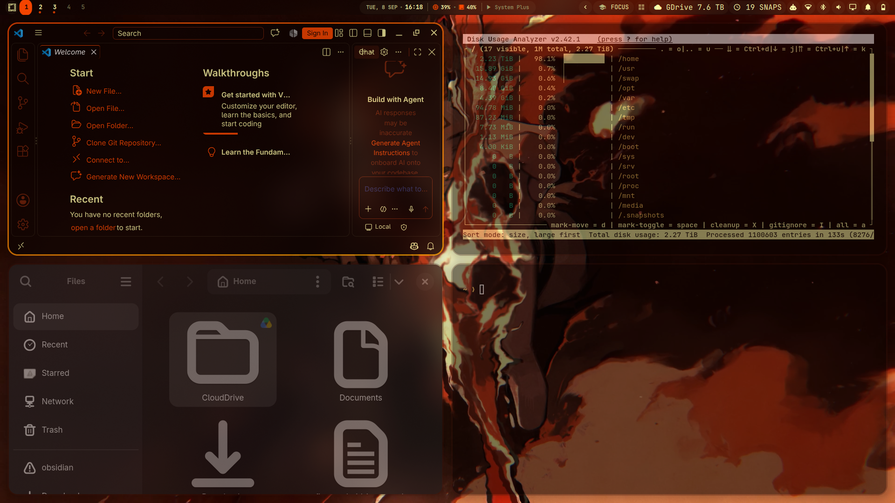
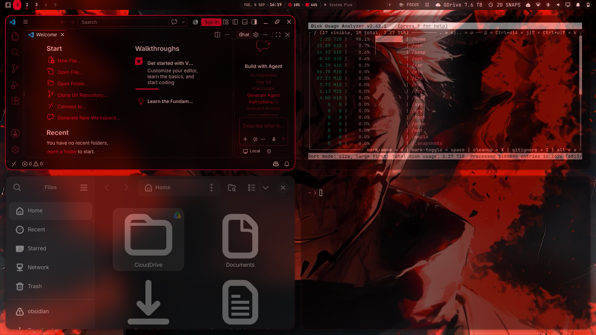
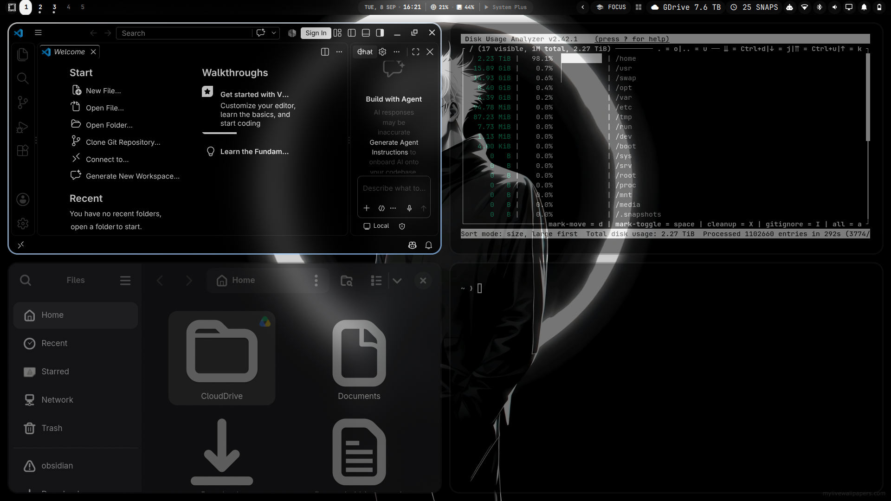
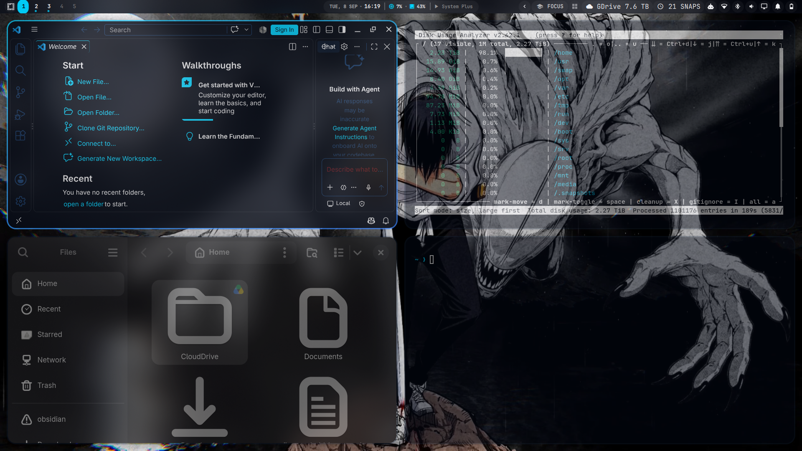
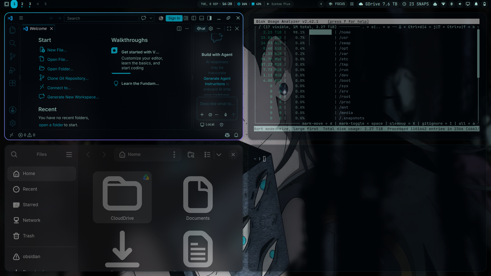
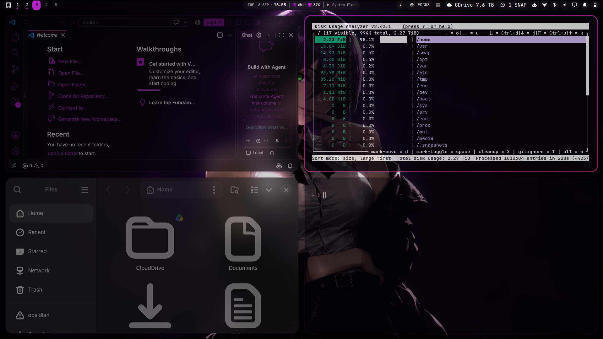
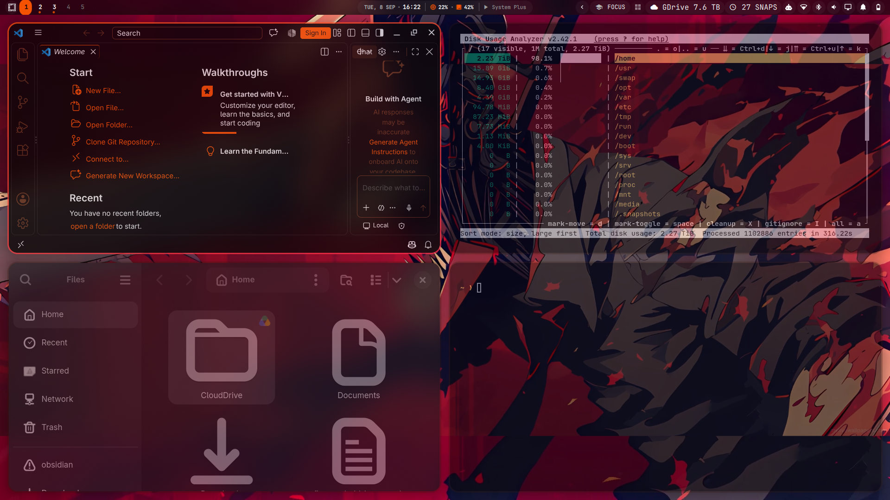
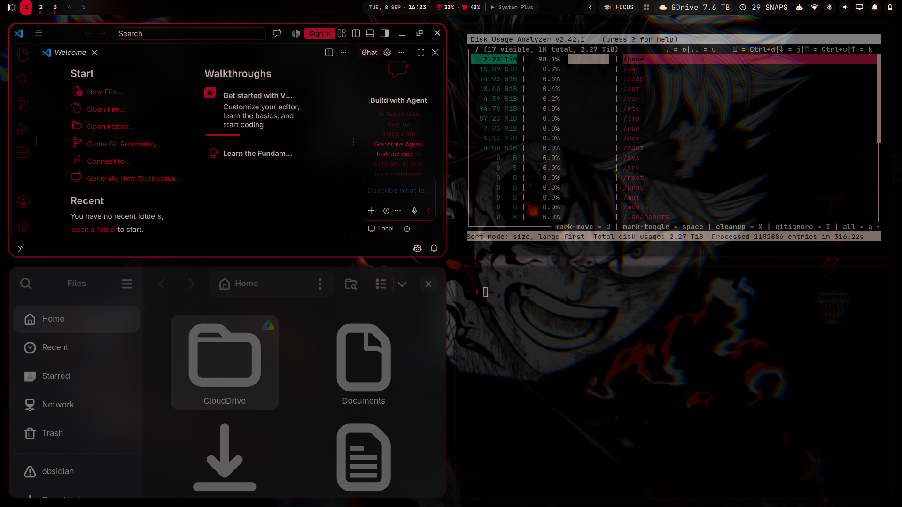
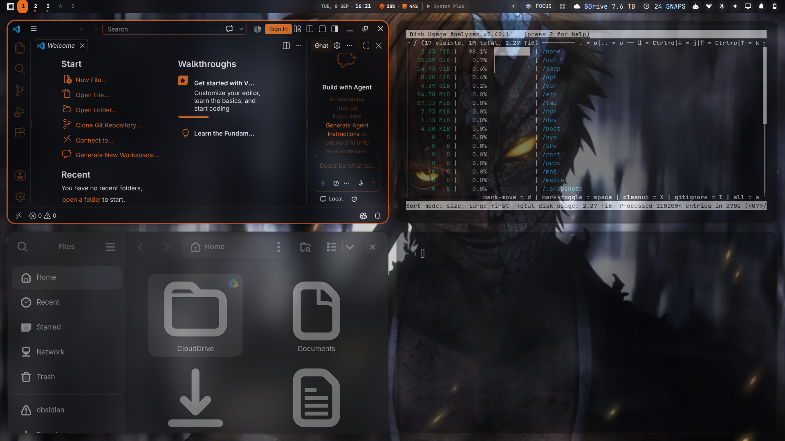
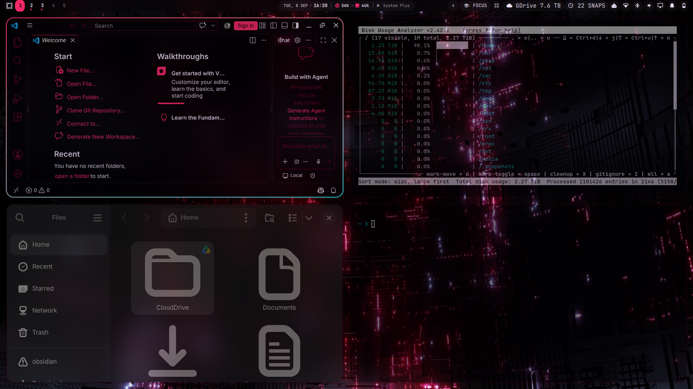
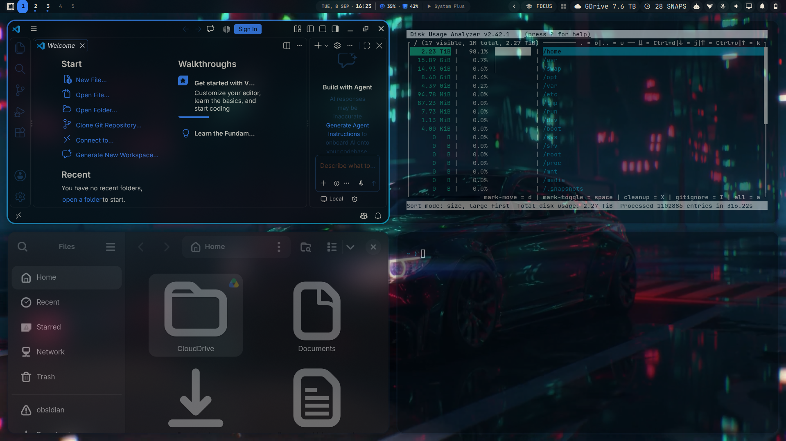

---

## License

This repository is distributed under the [MIT License](LICENSE).
